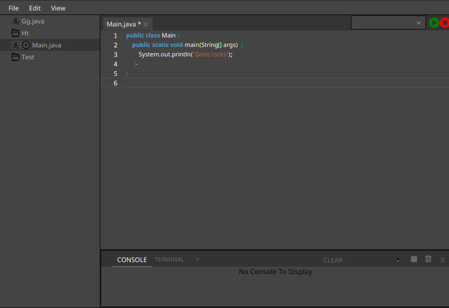

# Zenit
## A streamlined learning focused IDE



### What is Zenit?
The purpose of this project is to create a Java development application that is easy for beginners to understand. Many modern development tools are feature-rich but often complex and difficult to use. This can be a challenge for those learning to program, as they may have to spend more time understanding the tool rather than focusing on coding. This application aims to provide a simplified and beginner-friendly coding environment, making Java development more accessible for beginners.

### Why choose Zenit?
 Zenit is designed as an educational tool to help students learn Java programming in a simple and distraction-free environment. By offering an easy-to-use interface, Zenit ensures that students can focus on understanding Java concepts rather than dealing with complex development environments. Due to its simplicity, Zenit is well-suited for academic settings, making universities and educational institutions potential key customers. Additionally, Zenit is completely free, making it an accessible option for students, educators, and developers who want a cost-effective and efficient IDE. Unlike traditional IDEs that are overloaded with complex settings, Zenit prioritizes usability, speed, and efficiency, making it an excellent choice for anyone looking for a streamlined Java development experience.

### How to get started

Requirements:
- Java 23
- An IDE that supports Java and VM options

`git clone https://github.com/marcusmpersson/zenit`

Then open up the project in your choice of current IDE and navigate to: `src/main/java/zenit/ui/Launcher.java`

Make sure that your JRE runtime is set to Java 23 and then open "Run configurations" in your IDE for TestUI.java.

In the option "VM options" or "Arguments" add the following:
```
--module-path  
lib/javafx-sdk-21.0.6/lib/  
--add-modules=javafx.controls,javafx.fxml,javafx.web  
--add-opens  
javafx.graphics/javafx.scene.text=ALL-UNNAMED  
--add-exports  
javafx.graphics/com.sun.javafx.text=ALL-UNNAMED  
--add-opens  
javafx.graphics/com.sun.javafx.text=ALL-UNNAMED  
--add-exports  
javafx.graphics/com.sun.javafx.scene.text=ALL-UNNAMED  
--add-exports  
javafx.graphics/com.sun.javafx.scene=ALL-UNNAMED  
--add-exports  
javafx.graphics/com.sun.javafx.geom=ALL-UNNAMED  
-Dprism.allowhidpi=true
```

